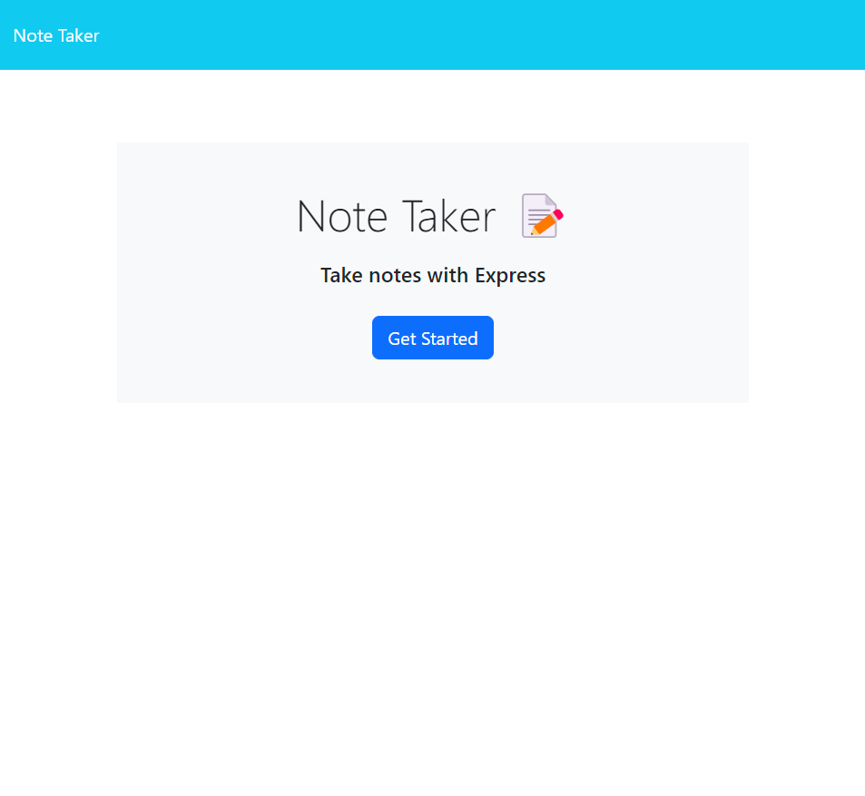

# note-taker1 []

## Description

For this project, we were assigned to make a note taker using express.js that takes notes input by the user, and saves them to view for later. 

## Table of Contents
[Installation](#installation)

  [Usage](#usage)

  [License](#license)

  [Test](#test)

  [Questions](#questions) 

  ## Installation 

The install command for this application is "npm i"

## Usage
Begin by hitting the Get Started button on the homepage. The input a note title and text that is associated with that note. Press the save button in the topo right-hand corner and your saved note will appear on the left side of the sceen.

## License
This project utilized the MIT License. 

  For more information see link: (https://opensource.org/licenses/MIT)

## Tests
N/A
## Questions

  ### Additional information and links are below, including my personal github account and email for contact information:

  [Github](https://github.com/mserafin20)

  [Email](mailto:mmserafin20@gmail.com)

